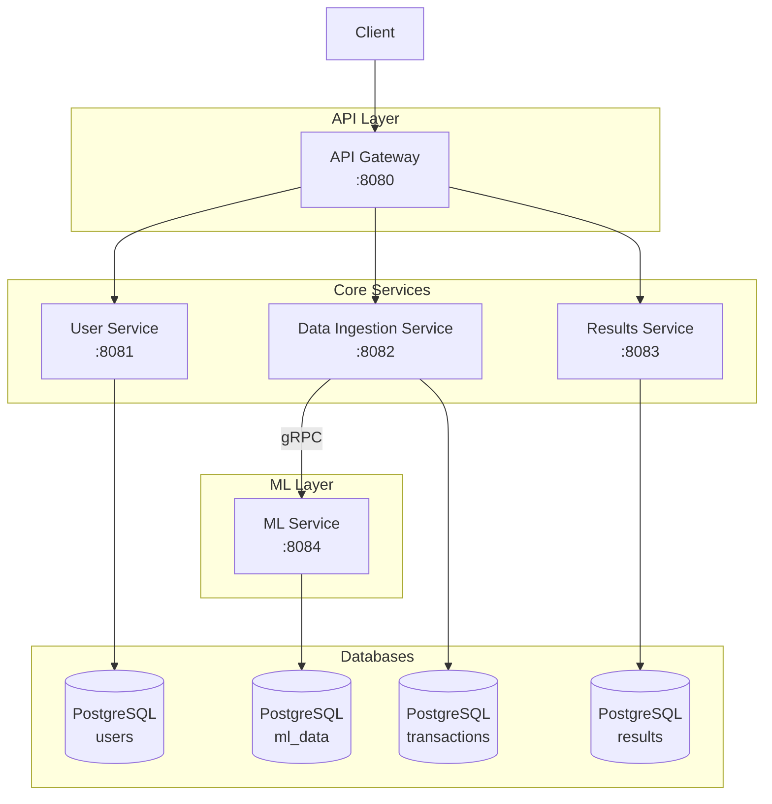

# FraudShield

> Real-time credit card fraud detection platform built on a microservices architecture using Spring Boot, gRPC, and Python ML inference.

---

## Architecture



---

## Services

| Service | Port | Description |
|---|---|---|
| **API Gateway** | `8080` | Entry point — JWT validation and request routing |
| **User Service** | `8081` | User registration, login, and JWT generation |
| **Data Ingestion Service** | `8082` | Receives transaction data, forwards to ML service via gRPC |
| **Results Service** | `8083` | Stores and exposes fraud prediction results |
| **ML Service** | `8084` | Python FastAPI service running a trained fraud detection model |

---

## Tech Stack

**Backend**
- Java 21, Spring Boot 4
- Spring Cloud Gateway, Spring Security, Spring Data JPA

**ML**
- Python, FastAPI
- scikit-learn, XGBoost

**Communication**
- REST — external client-facing APIs
- gRPC — internal service-to-service (Data Ingestion → ML)

**Database**
- PostgreSQL (one instance per service)

**Infrastructure**
- Docker, Docker Compose
- AWS — ECS, ECR, RDS

---

## Service Status

| Service | Status |
|---|---|
| API Gateway | ✅ Complete |
| User Service | ✅ Complete |
| Data Ingestion Service | ✅ Complete |
| Results Service | ✅ Complete |
| ML Service | 🔄 In Progress |

---

## Getting Started

### Prerequisites

- Docker & Docker Compose
- Java 21
- Python 3.10+

### Run with Docker Compose

Start the infrastructure (databases, etc.):

```bash
docker compose up -d
```

### Run Services Individually

**API Gateway**
```bash
cd api-gateway
./mvnw spring-boot:run
```

**User Service**
```bash
cd user-service
./mvnw spring-boot:run
```

**Data Ingestion Service**
```bash
cd data-ingestion-service
./mvnw spring-boot:run
```

**Results Service**
```bash
cd results-service
./mvnw spring-boot:run
```

**ML Service**
```bash
cd ml-service
pip install -r requirements.txt
uvicorn main:app --port 8084
```

---

## Project Structure

```
fraudshield/
├── api-gateway/           # Spring Cloud Gateway — routing & JWT validation
├── user-service/          # Auth service — registration, login, JWT
├── data-ingestion-service/ # Transaction intake & gRPC forwarding
├── results-service/       # Prediction result storage & exposure
├── ml-service/            # Python FastAPI fraud detection model
└── docker-compose.yml     # Infrastructure orchestration
```
